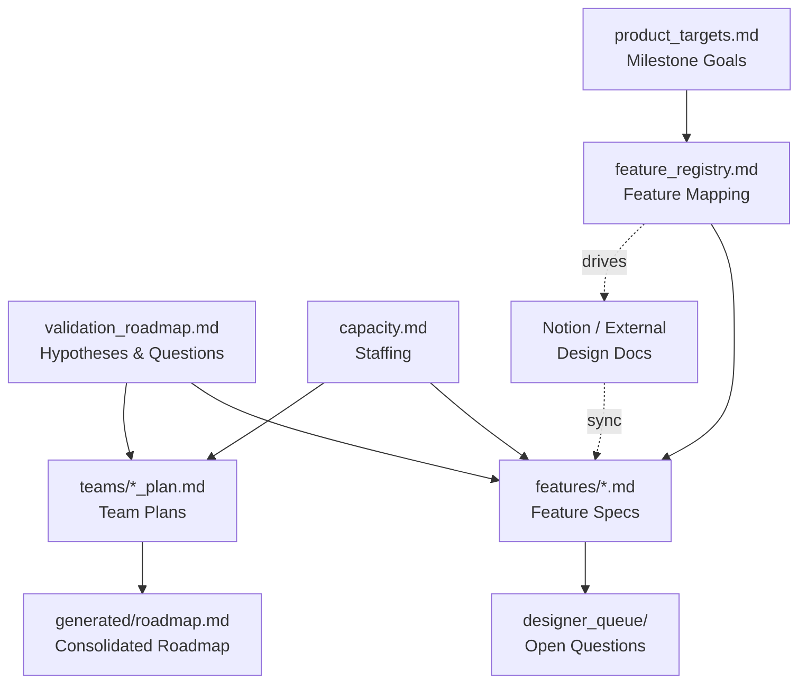

# Project Charter

> This document defines the architecture, rules, and principles for this documentation brain.
> It is the first file any LLM or new team member should read.

---

## Purpose

This documentation brain is the **single source of truth for project planning**. It contains structured markdown files that humans author and LLMs read to provide context-aware assistance — risk analysis, spec authoring, gap detection, roadmap generation, and more.

The brain does NOT replace your task tracker (ClickUp, Jira, etc.) or your design tool (Notion, Confluence, etc.). It sits between them:

```
External Sources               Documentation Brain              Task Tracker
(Notion, Confluence)  -sync->  planning/ files        -inform-> (ClickUp, Jira)
                               generated/ views                  Sprint-level tasks
                               reference/ raw data
```

- **Strategic planning** happens here (milestones, features, validation, capacity)
- **Sprint-level execution** happens in your task tracker
- **Design detail** lives in your design tool and gets synced here as feature specs

---

## File Structure

```
Root
  project-charter.md          This file — architecture and rules
  ONBOARDING.md               How to populate the brain
  EXAMPLES.md                 Usage examples

planning/                      Human-authored sources of truth
  product_targets.md           Milestone goals, must-have features, success criteria
  capacity.md                  Team staffing by discipline across milestones
  validation_roadmap.md        Hypotheses, big questions, sub-questions
  feature_registry.md          Feature-to-source mapping (drives spec sync)
  dependency_map.md            Cross-team and cross-feature dependencies
  global_rules.md              Project-wide constraints and standards
  teams/                       Per-team plans (priorities, validation focus)
    [team]_plan.md
  features/                    Feature specs (one per feature)
    [feature].md
  designer_queue/              Q&A pipeline for designers
    designer_queue.md          Open questions tracking
    raw_input/                 Unprocessed designer responses
    clean_input/               Validated responses
    output/                    Applied changes log

generated/                     Skill-generated views (disposable, regenerated)
  roadmap.md                   Consolidated roadmap
  roadmap_options.md           Draft roadmap scenarios

reference/                     Ingested source data (CSVs, exports, PDFs)

.claude/
  commands/                    Skills (slash commands)
    [skill-name].md
```

---

## Architecture Principles

### 1. One Source of Truth Per Concept

Every piece of information has ONE authoritative home. Other files reference it, never duplicate it.

| Information | Authoritative File | Reference By |
|-------------|-------------------|--------------|
| Milestone goals & must-have features | `planning/product_targets.md` | Feature name |
| Team staffing, roles, assignments | `planning/capacity.md` | Person/role name |
| Validation hypotheses & questions | `planning/validation_roadmap.md` | Question ID (e.g., SHQ7) |
| Feature scope, cost, approach | `planning/features/*.md` | Feature name + link |
| Team priorities & validation focus | `planning/teams/*_plan.md` | Team name |
| Feature-to-source mapping | `planning/feature_registry.md` | Feature name |
| Cross-project constraints | `planning/global_rules.md` | Rule name |

**Test**: If you're about to write the same fact in a second file, stop. Add a reference to the authoritative file instead.

### 2. Planning Is Authoritative, Generated Is Disposable

- `planning/` files are **human-authored sources of truth**. Skills may update them, but only with user approval.
- `generated/` files are **skill-generated views** that can be blown away and regenerated at any time. No human should manually edit them.
- `reference/` files are **raw ingested data** — source material, not authoritative plans.

### 3. The Triangle: Targets vs Plans vs Resources

Three files form the core tension that drives planning:

```
product_targets.md     "What must each milestone achieve?"
       |
       | compared against
       v
roadmap.md             "What are we actually building?"
(from team plans)
       |
       | checked against
       v
capacity.md            "Do we have the people?"
```

Most analysis skills (risk evaluation, roadmap options, validation review) compare some combination of these three.

### 4. Reference, Don't Duplicate

- Validation questions are referenced by ID (`SHQ7`), not copied in full
- Features are referenced by name and link, not re-described
- If a skill needs to display information from another file, it reads and summarizes — it doesn't create a copy

### 5. Skills Are Safe to Run Repeatedly

- Skills should be **idempotent** or **additive** — running them twice shouldn't break anything
- Skills should never auto-overwrite human-authored content without explicit user approval
- Skills should never delete files or data without confirmation

---

## File Relationships



### Reading Order for LLMs

When an LLM needs to understand the project, it should read files in this order:

1. `project-charter.md` — Architecture and rules (this file)
2. `product_targets.md` — What we're trying to achieve
3. `capacity.md` — Who's available
4. `validation_roadmap.md` — What we're trying to prove
5. `feature_registry.md` — What features exist and where their docs are
6. Team plans — What each team is building
7. Feature specs — Detail on specific features (read on demand)

---

## Feature Spec Template

All feature specs follow a consistent structure. The template is defined in `ONBOARDING.md` and the first spec you create becomes the living reference.

Key sections (in order):
1. **Why This Feature** — Validation goals, parent hypothesis, success criteria
2. **Scope** — What it does, core mechanics, in/out of scope
3. **Estimate & Approach** — Disciplines, sprint estimates, implementation flow, pre-conditions
4. **Dependencies** — What this depends on and what depends on it
5. **Risks** — Impact, probability, mitigation
6. **Open Questions** — Unresolved design decisions
7. **References** — Links to external docs

**Validation goals come first** — every feature should be traceable to a hypothesis or question the team is trying to answer.

---

## Validation Model

The brain uses a hierarchical validation model:

```
Winning Hypotheses (3-5)
  "We believe [core bet about the product]"
    |
    v
Big Hypothesis Questions (BHQs)
  "Can we prove [major aspect of the hypothesis]?"
    |
    v
Sub-Hypothesis Questions (SHQs)
  "Does [specific thing] work as expected?"
  (Testable in a milestone, tied to features)
```

- **Hypotheses** are stable — they rarely change
- **BHQs** are broad — they span multiple teams and milestones
- **SHQs** are specific — they can be answered by building and testing specific features
- Features reference SHQs by ID in their "Why This Feature" section
- SHQs are NOT necessarily team-specific — many are cross-team questions

---

## Skill Architecture

Skills are slash commands (`.claude/commands/*.md`) that automate common workflows.

### Skill Design Principles

1. **Read-Assess-Act-Summarize**: Read project state, assess against criteria, take action (with approval), summarize what changed.
2. **Graceful Degradation**: If an external source isn't available, do useful work with what's available.
3. **Flag, Don't Fix**: When a skill spots a problem outside its scope, flag it and suggest which skill to run — don't try to fix everything.
4. **Questions Grouped by Owner**: When generating action items, group by the responsible person (from capacity.md).

### Core Skills

| Skill | Purpose | Reads | Writes |
|-------|---------|-------|--------|
| `/spec-sync` | Sync feature registry + external docs to local specs | feature_registry, features/, external source | features/, designer_queue |
| `/risk-evaluation` | Compare targets vs plans vs resources | product_targets, roadmap, capacity | Report (no file changes) |
| `/roadmap-update` | Update team plans, regenerate roadmap | team plans, features/ | teams/, generated/roadmap.md |
| `/validation-review` | Evaluate validation progress | validation_roadmap, features/, team plans | Report (no file changes) |
| `/doc-author` | Interactive spec authoring | features/, all planning files | features/ |
| `/designer-quiz` | Collect designer answers to open questions | designer_queue, capacity | raw_input/ |
| `/queue-review` | Validate and apply designer answers | raw_input/, features/ | clean_input/, output/, features/, designer_queue |

### Creating New Skills

Before creating a skill, check:
- [ ] Does an existing skill already cover this? (Extend, don't duplicate)
- [ ] Does it create a new source of truth? (**Red flag** — can this data live in an existing file?)
- [ ] Does it write to `planning/` files? (Must ask for user confirmation)
- [ ] Is it safe to run twice? (Must be idempotent or additive)
- [ ] Will it create files nobody maintains? (Prefer generated/ for outputs)

See `EXAMPLES.md` for a skill creation walkthrough.

---

## Rules for LLMs

When operating in this brain:

1. **Read before writing** — Always read the current state of files before proposing changes
2. **Respect authority** — The authoritative file for a concept is the only place to update it
3. **Ask before overwriting** — Never auto-replace human-authored content in `planning/`
4. **Use IDs for references** — Reference SHQs, BHQs, and question IDs by their identifiers, not by copying full text
5. **Follow the template** — Feature specs must match the established template structure
6. **Surface conflicts** — If two files disagree, flag it rather than silently picking one
7. **Stay in scope** — Each skill has a focused job; flag issues outside that scope for the appropriate skill
8. **Degrade gracefully** — If an external source (Notion, etc.) isn't available, work with local files

---

## Change Log

| Date | Change | Author |
|------|--------|--------|
| | Initial charter | |
